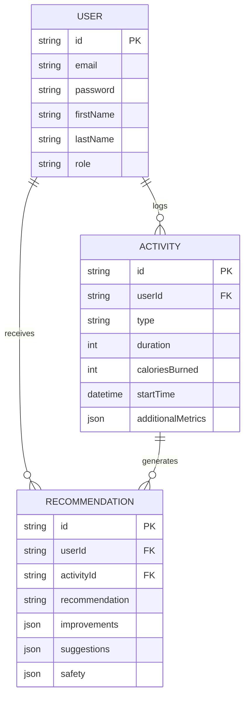

# 🏋️ Fitness Tracking API — Fitness Monolith

A production-grade RESTful backend for tracking fitness activities and generating personalized recommendations — built with Spring Boot, Spring Security (JWT), and PostgreSQL.

> Part of the [spring-boot-learning](https://github.com/lovekumar179/spring-boot-learning) repository — built while learning Spring Boot in depth.

[](https://hub.docker.com/r/lovekumar58/fitness-app-monolith)
🐳 **Docker Image:** [`lovekumar58/fitness-app-monolith`](https://hub.docker.com/r/lovekumar58/fitness-app-monolith)

---

## 📖 Overview

Fitness Monolith lets users:
- Register and authenticate securely (JWT-based auth)
- Track fitness activities (running, cycling, yoga, HIIT, etc.) with custom metrics
- Receive and retrieve personalized recommendations tied to their activities

The application follows a clean **layered architecture** (Controller → Service → Repository → Entity) and exposes interactive API docs via **Swagger/OpenAPI**.

---

## 🛠 Tech Stack

| Layer            | Technology                                      |
|-------------------|--------------------------------------------------|
| Language          | Java 21                                          |
| Framework         | Spring Boot                                      |
| Persistence       | Spring Data JPA / Hibernate                      |
| Database          | PostgreSQL                                       |
| Security          | Spring Security + JWT (`jjwt` 0.13.0)            |
| Validation        | Jakarta Bean Validation (`spring-boot-starter-validation`) |
| API Docs          | springdoc-openapi (Swagger UI)                   |
| Boilerplate       | Lombok                                           |
| Build Tool        | Maven                                            |
| Containerization  | Docker                                           |

---

## 📁 Project Structure

```
src/main/java/com/project/fitness/
├── config/          → OpenApiConfig (Swagger/OpenAPI setup)
├── controller/      → AuthController, ActivityController, RecommendationController
├── dto/             → Request/response DTOs
├── exceptions/      → GlobalExceptionHandler (validation error handling)
├── model/           → JPA entities: User, Activity, Recommendation (+ enums)
├── repository/      → Spring Data JPA repositories
├── security/        → JwtUtils, JwtAuthenticationFilter, SecurityConfig, CustomUserDetailsService
├── service/         → Business logic: UserService, ActivityService, RecommendationService
└── FitnessMonolithApplication.java

src/main/resources/
├── application.properties
└── schema.sql       → Database schema (manually maintained, DBeaver-generated)
```

---

## 🗄 Data Model



- **User** — `USER` or `ADMIN` role, one-to-many with Activities and Recommendations
- **Activity** — type is an enum: `RUNNING`, `WALKING`, `CYCLING`, `SWIMMING`, `WEIGHT_TRAINING`, `YOGA`, `HIIT`, `CARDIO`, `STRETCHING`, `OTHER`
- **Recommendation** — tied to a specific User + Activity, stores structured JSON feedback

---

## 🔐 Authentication

Auth is JWT-based, stateless:

1. `POST /api/auth/register` → creates a user (password hashed with BCrypt)
2. `POST /api/auth/login` → validates credentials, returns a signed JWT
3. Subsequent requests must include the token:
   ```
   Authorization: Bearer <token>
   ```
4. `JwtAuthenticationFilter` validates the token on every request and populates the security context with the user's roles.

**Access rules** (`SecurityConfig`):
| Route pattern            | Access           |
|----------------------------|------------------|
| `/api/auth/**`              | Public           |
| `/swagger-ui/**`, `/v3/api-docs/**` | Public   |
| `/api/admin/**`             | `ROLE_ADMIN` only |
| Everything else             | Authenticated    |

---

## 📡 API Endpoints

### Auth — `/api/auth`
| Method | Endpoint    | Description                     | Auth   |
|--------|-------------|----------------------------------|--------|
| POST   | `/register` | Register a new user              | Public |
| POST   | `/login`    | Authenticate, returns JWT + user | Public |

### Activities — `/api/activities`
| Method | Endpoint | Description                              | Auth Required |
|--------|----------|--------------------------------------------|----------------|
| POST   | `/`      | Log a new activity                         | ✅ |
| GET    | `/`      | Get all activities for a user (`X-User-ID` header) | ✅ |

### Recommendations — `/api/recommendation`
| Method | Endpoint                   | Description                               | Auth Required |
|--------|------------------------------|---------------------------------------------|----------------|
| POST   | `/generate`                  | Generate a recommendation for an activity   | ✅ |
| GET    | `/user/{userId}`             | Get all recommendations for a user          | ✅ |
| GET    | `/activity/{activityId}`     | Get all recommendations for an activity     | ✅ |

Full interactive docs available via Swagger UI once the app is running.

---

## 🚀 Getting Started

### Prerequisites
- Java 21
- Maven (or use the included `./mvnw`)
- PostgreSQL (local or via Docker)

### 1. Clone the repo
```bash
git clone https://github.com/lovekumar179/spring-boot-learning.git
cd spring-boot-learning/projects/fitness-monolith
```

### 2. Set environment variables
The app reads DB config from environment variables — **do not hardcode credentials**:

| Variable  | Description                       |
|-----------|-------------------------------------|
| `DB_URL`  | JDBC URL, e.g. `jdbc:postgresql://localhost:5432/fitness-db` |
| `DB_USER` | Database username                  |
| `DB_PWD`  | Database password                  |

### 3. Load the schema
The schema lives in `src/main/resources/schema.sql`. Make sure `application.properties` is set to:
```properties
spring.jpa.hibernate.ddl-auto=update
spring.sql.init.mode=always
```
so Spring Boot loads `schema.sql` on startup instead of letting Hibernate auto-manage tables.

### 4. Run locally
```bash
./mvnw spring-boot:run
```

### 5. Run with Docker

**Option A — pull the published image from Docker Hub:**
```bash
docker pull lovekumar58/fitness-app-monolith
docker run -p 8080:8080 \
  -e DB_URL=jdbc:postgresql://<host>:5432/fitness-db \
  -e DB_USER=<user> \
  -e DB_PWD=<password> \
  lovekumar58/fitness-app-monolith
```

**Option B — build it yourself from source:**
```bash
docker build -t fitness-monolith .
docker run -p 8080:8080 \
  -e DB_URL=jdbc:postgresql://<host>:5432/fitness-db \
  -e DB_USER=<user> \
  -e DB_PWD=<password> \
  fitness-monolith
```

---

## 📚 API Documentation

Once running, Swagger UI is available at:
```
http://localhost:8080/swagger-ui.html
```

---

## 🧭 Known Improvements / Roadmap

- Move the JWT signing secret out of source code into an environment variable
- Add an `/api/admin/**` controller (route is already security-guarded but not yet implemented)
- Add automated tests (unit + integration)
- Add pagination for activity/recommendation list endpoints

---


## 👤 About the Author

**Love Kumar** — Backend developer focused on building robust, production-style APIs with Java and Spring Boot. This project reflects hands-on practice with layered architecture, JWT-based authentication, Spring Security, JPA/Hibernate, and containerizing applications with Docker — built as part of a broader journey into backend engineering.

📧 lovekumar4782@gmail.com
💼 [LinkedIn](https://www.linkedin.com/in/lovekumar58)
🔗 [GitHub](https://github.com/lovekumar179/spring-boot-learning/tree/main/projects/fitness-monolith)
